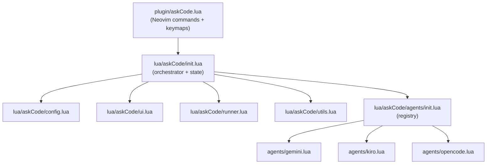
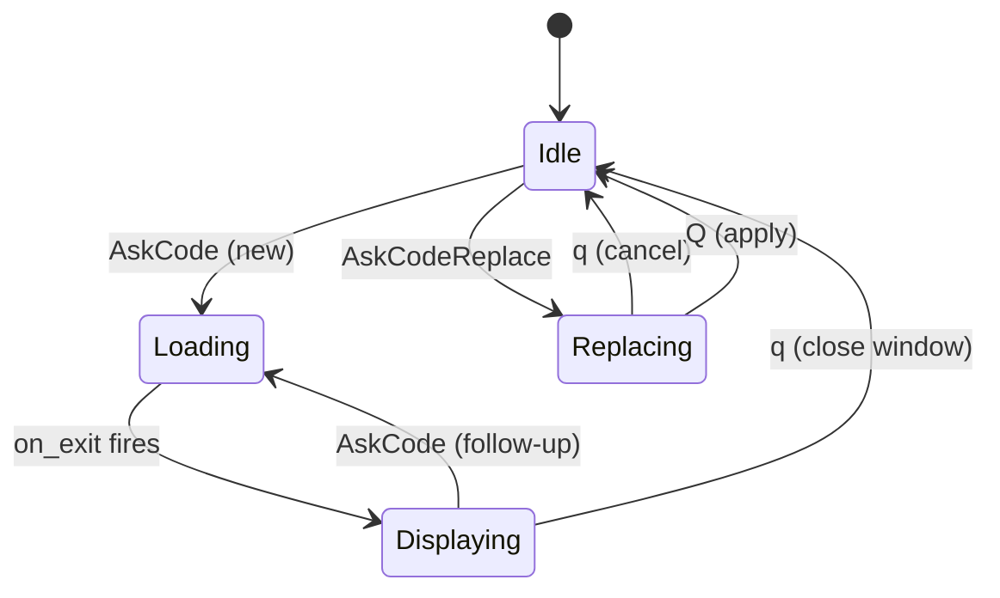

# Architecture — askCode.nvim

## Layer Diagram

## Module Responsibilities

| Module | Role |
|---|---|
| `plugin/askCode.lua` | Defines `:AskCode`, `:AskCodeReplace`, `:AskCodeConfig` commands and `<Plug>` keymaps |
| `init.lua` | Holds conversation `state`, builds prompts, wires async callbacks |
| `config.lua` | Stores and merges config; exposes dot-notation get/set |
| `ui.lua` | Creates float/split windows, handles `q`/`Q` keymaps |
| `runner.lua` | Thin `vim.fn.jobstart` wrapper with `stdin = "null"` default |
| `utils.lua` | File I/O, buffer reads, replacement parsing, debug logging |
| `agents/*` | Each agent implements `prepare_command` + `parse_response` |

## Conversation State Machine

## Key Design Decisions

- **Async via jobstart**: all CLI calls use `vim.fn.jobstart` with `stdout_buffered = true`; `on_exit` delivers the full response at once.
- **`stdin = "null"`**: runner sets stdin to `/dev/null` by default so interactive CLIs don't block waiting for input.
- **History as temp file**: conversation history is written to `vim.fn.tempname()` and re-sent in full on every follow-up, keeping state simple.
- **`vim.schedule()` for UI**: all `update_window` calls are deferred to avoid crossing the async boundary.
- **Config merging with `"keep"`**: `vim.tbl_deep_extend("keep", changes, current)` — user-supplied values always win over defaults.
