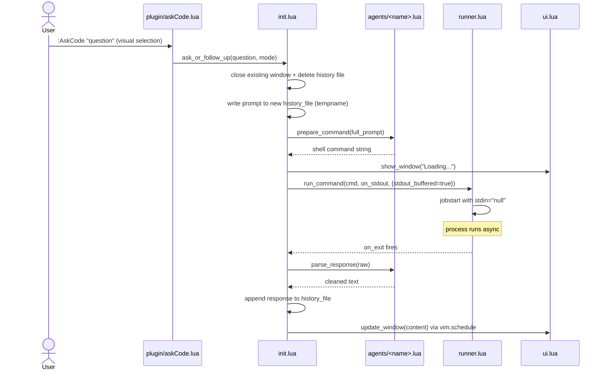
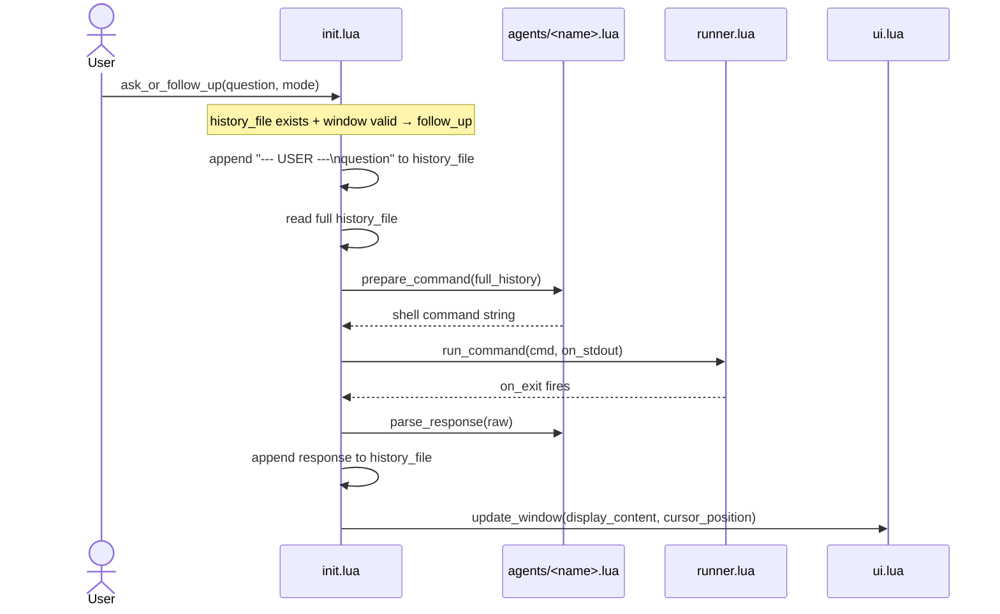
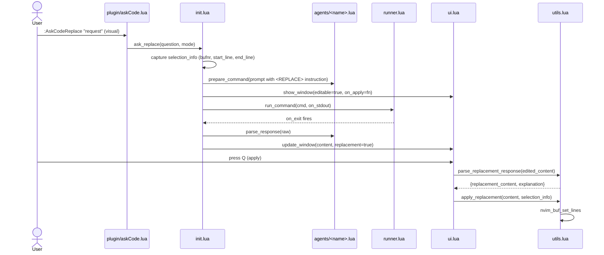
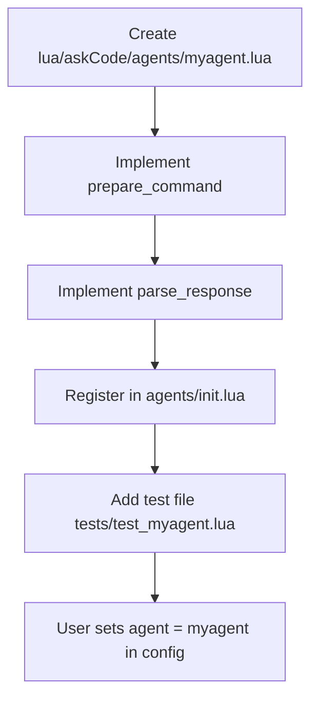

# Workflows — askCode.nvim

## New Conversation (`:AskCode`)



## Follow-up Question



## Code Replacement (`:AskCodeReplace`)



## Adding a New Agent



## Config Change at Runtime

```
:AskCodeConfig agent opencode
  → plugin/askCode.lua parses args
  → init.set_config("agent", "opencode")
  → config.set() builds nested table, calls merge_with_default
  → config.current_config updated immediately
  → next :AskCode call uses new agent
```
